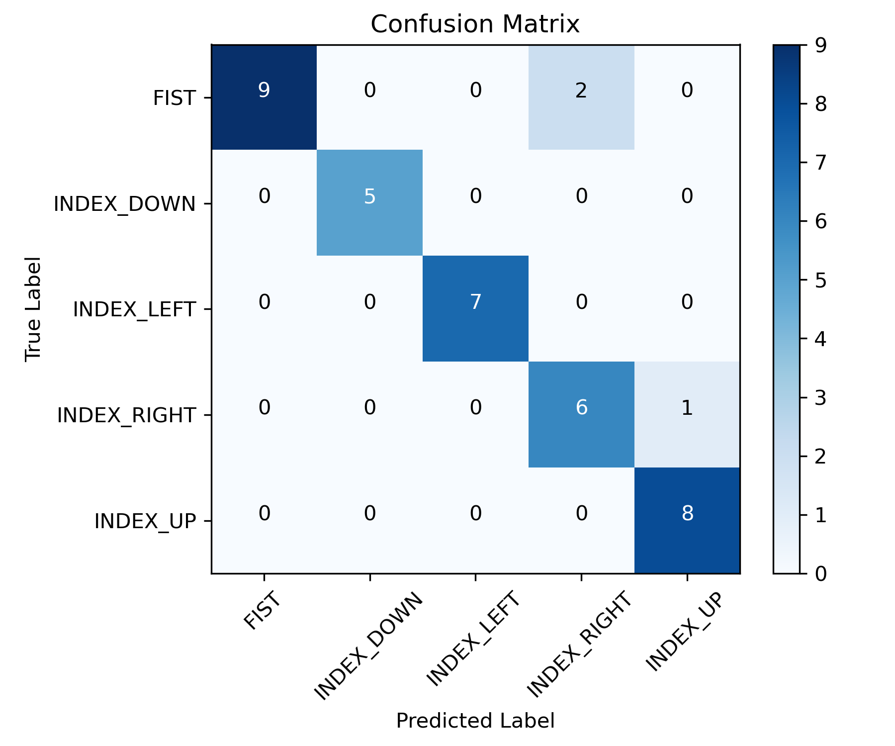
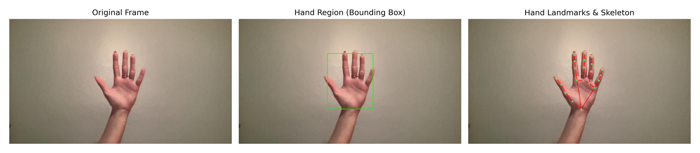
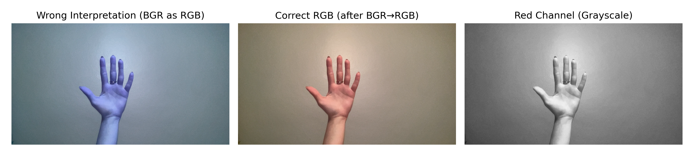
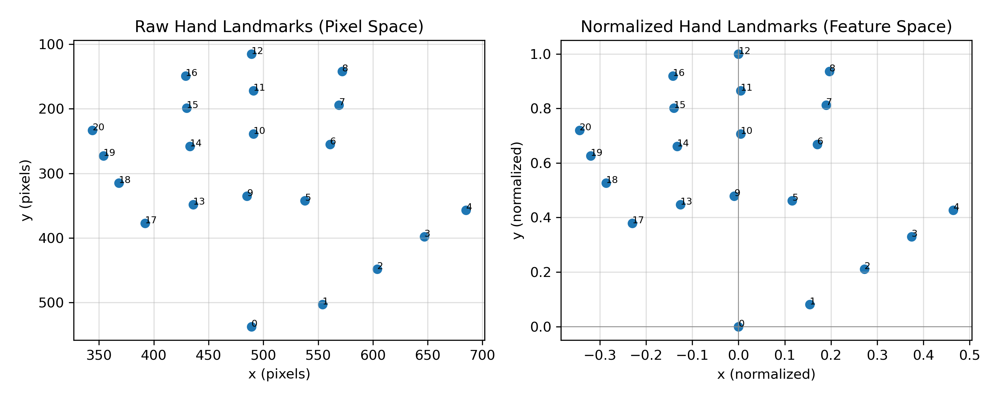
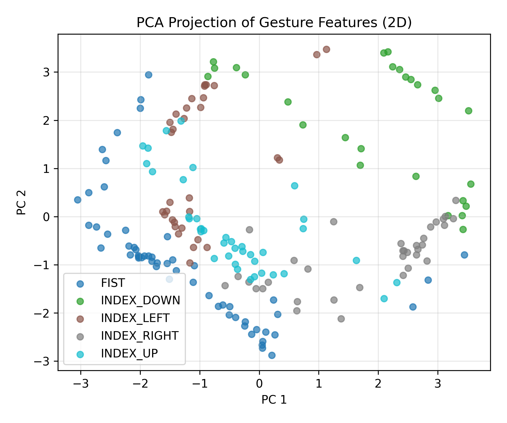
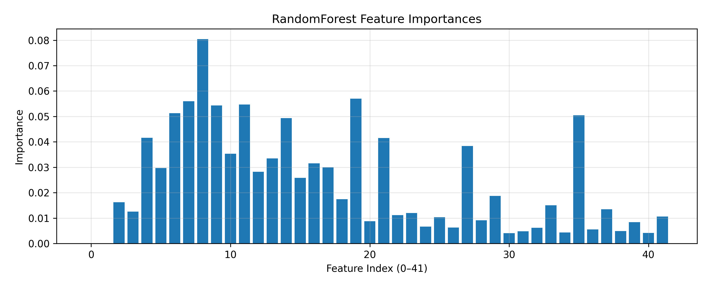
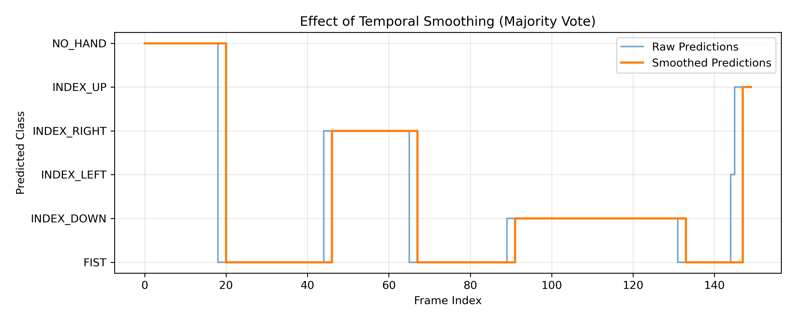
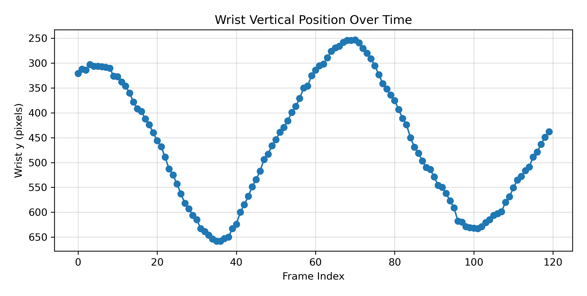

# Real-Time Hand Gesture Recognition System

As modern computer interfaces are evolving into touch and voice commands, a **real-time hand gesture recognition** offers a natural way to control computers without physical contact. 

This project uses 21 hand landmarks detected by webcam through MediaPipe Hands to perform gesture classification with a machine learning model and convert them into keyboard and scroll commands on your computer.

The system detects hand landmarks, classifies gestures, and performs actions such as:

- Navigating with arrow keys
- Scrolling using fist motion
- Adjusting media/YouTube volume
- General window navigation


## About The Project

The project implements a Python-based gesture recognition pipeline:

* **MediaPipe Hands** for detecting 21 hand landmarks
* **Custom feature extraction** for normalization
* **RandomForest classifier** for gesture recognition
* **pyautogui** for real-time OS-level control
* **Temporal smoothing** and **cooldown logic** for stable predictions

Supported gestures include:
* `IDLE` (Palm state)

* `FIST` (used for dynamic scrolling)

* `INDEX_RIGHT`

* `INDEX_LEFT`

* `INDEX_UP`

* `INDEX_DOWN`


## 📂 Project Structure
```
REALTIME-HAND-GESTURE-RECOGNITION/
│
├── assets/
│
├── data/
│   ├── raw/                    # Collected CSV gesture data
│   └── models/                 # Trained ML models (.pkl)
│
├── src/
│   ├── capture/
│   │   ├── camera_test.py
│   │   ├── hand_tracking.py    # Basic hand visualization
│   │   └── collect_data.py     # Gesture data collection
│   │
│   ├── preprocessing/
│   │   ├── feature_extraction.py  # Landmark normalization
│   │   └── utils.py               # Helper geometry functions
│   │
│   ├── models/
│   │   ├── train_classifier.py    # RandomForest training
│   │   ├── evaluation.py          # Independent model evaluation
│   │   └── train_lstm.py          # (Future work) LSTM model
│   │
│   ├── realtime/
│   │   └── realtime_control.py    # Main real-time control system
│   │
│   └── visualization/
│
├── requirements.txt
└── README.md
```


## Setup Instructions

### 1. Clone the Repository

```bash
git clone <repo-url>
cd REALTIME-HAND-GESTURE-RECOGNITION
```

### 2. (Optional) Create a Virtual Environment
```bash
python -m venv .venv
source .venv/bin/activate
```

### 3. Installation Dependencies
```bash
pip install -r requirements.txt
```

## Usage

### 1. Test Camera
```bash
python src/capture/camera_test.py
```

### 2. Collect Gesture Data
Example: collect `FIST`
```bash
python src/capture/collect_data.py FIST
```

Your collected samples are stored automatically in:
```bash
data/raw/gestures.csv
```

Repeat for:
* `INDEX_RIGHT`
* `INDEX_LEFT`
* `INDEX_UP`
* `INDEX_DOWN`
* `FIST`

### 3. Train The Gesture Classifier
```bash
python src/models/train_classifier.py
```

This generates:
* `data/models/gesture_rf.pkl`
* `data/models/label_encoder.pkl`

### Model Performance

The gesture classifier was trained using a RandomForest model.

Overall accuracy: **92%**

### Classification Summary
| Class       | Precision  | Recall  | F1-score  | Support  |
|-------------|------------|----------|------------|----------|
| FIST        | 1.00       | 0.82     | 0.90       |  11      |
| INDEX_DOWN  | 1.00       | 1.00     | 1.00       |  5       |
| INDEX_LEFT  | 1.00       | 1.00     | 1.00       |  7       |
| INDEX_RIGHT | 0.75       | 0.86     | 0.80       |  7       |
| INDEX_UP    | 0.89       | 1.00     | 0.94       |  8       |

* Macro average F1-score: 0.93
* Weighted average F1-score: 0.92

### Confusion Matrix

(Each row = true label, each column = predicted label)

### 4. Run Real-Time Gesture Control
```bash
python src/realtime/realtime_control.py
```
Make sure the window you want to control (browser, file explorer, etc.) is focused.

## Gesture-to-Command Mapping
| Gesture      | Description        | Command        |
|--------------|--------------------|----------------|
| INDEX_RIGHT  | Pointing right     | → Arrow Right  |
| INDEX_LEFT   | Pointing left      | ← Arrow Left   |
| INDEX_UP     | Finger up          | ↑ Arrow Up     |
| INDEX_DOWN   | Finger down        | ↓ Arrow Down   |
| FIST + Up    | Fist moving up     | Scroll Up      |
| FIST + Down  | Fist moving down   | Scroll Down    |
| Open Palm    | Neutral rest pose  | No Action.     |

The system uses: 
- Majority voting (temporal smoothing) over last N frames.
- Cooldown timing to prevent noisy or repeated false triggers.

## System Overview & Pipeline Visualization
The overall real-time hand gesture recognition pipeline consists of hand detection, landmark extraction, feature normalization, gesture classification, and OS-level command execution.

### Real-Time Processing Pipeline

From left to right: original camera frame, detected hand region (ROI), extracted hand landmarks, gesture classification, and command execution.

This pipeline ensures low-latency gesture recognition suitable for real-time human–computer interaction.

## Hand Landmark Detection & Skeleton Representation
The system uses MediaPipe Hands to detect 21 anatomically consistent hand landmarks in real time. These landmarks form a skeletal representation of the hand, enabling robust geometric analysis independent of hand size and position.


Original frame (left) and detected MediaPipe hand landmarks with skeletal connections (right).

This representation allows the system to:
- Capture finger articulation and hand posture
- Maintain robustness against scale and translation
- Provide interpretable geometric features for classification

## Color Space Conversion & Preprocessing
Correct color space handling is essential for stable hand detection. Since OpenCV captures images in BGR format, frames are converted to RGB before being passed to MediaPipe.


Left: incorrect BGR interpretation, Middle: correct RGB image, Right: red channel visualization.

## Landmark Normalization & Feature Space
To ensure scale and translation invariance, raw pixel-based landmarks are normalized relative to the wrist position and hand size.


Raw landmark coordinates in pixel space (left) and normalized landmark representation in feature space (right).

This normalization step allows the model to generalize across different users and camera distances.

## PCA-Based Feature Visualization
Principal Component Analysis (PCA) is applied to normalized landmark features for visualization purposes. This provides insight into the separability of gesture classes.


Two-dimensional PCA projection of gesture features.

Distinct clusters are observed for different gesture classes, indicating strong discriminative feature representations.

## Feature Importance Analysis

To better understand the decision-making process of the RandomForest classifier, feature importance scores were analyzed.


RandomForest feature importance scores for normalized landmark features.

The model relies more heavily on landmarks related to finger tips and wrist orientation, which are critical for gesture discrimination.

## Temporal Smoothing & Prediction Stability

Raw frame-by-frame predictions can fluctuate due to minor hand tremors or transient misdetections. To address this, majority voting (temporal smoothing) is applied over consecutive frames.


Comparison of raw gesture predictions and temporally smoothed predictions over time.

This mechanism significantly improves command stability and prevents unintended actions.

## Wrist Motion Tracking for Scrolling

Scrolling actions are controlled using vertical wrist movement when the FIST gesture is detected.


Consistent upward and downward motion patterns correspond to scroll-up and scroll-down commands.